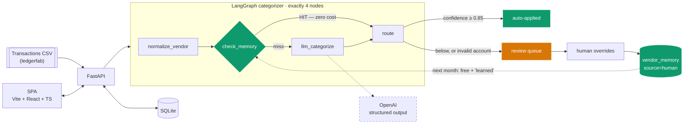

# SpendSort

<!-- SCREENSHOT
     Spec 00 A1 puts a screenshot first. There isn't one, and none has been faked or borrowed.
     No browser was available in the build environment (BLOCKERS.md B7), so nobody has yet
     *looked* at these screens — see STATUS below. To produce it: `make dev`, open
     http://localhost:5173, upload examples/month_01_realistic_seed42.csv, run, then capture
     the Metrics screen (the memory bend is the shot worth having).
-->

> **📸 Screenshot: not yet captured.** See [STATUS](#status) — this is a real gap, not an oversight.

**The simplest honest finance agent: it categorizes your card transactions, tells you how sure
it is, and only acts alone when it has earned the right to.**

Expense categorization is the highest-volume, lowest-risk finance AI workflow — the right first
agent to build. SpendSort is the reference implementation of the whole trust pattern in its
smallest form: **confidence → gate → learn.** Finance AI Lab, episode 1.

---

## Architecture



Three things make this more than a prompt in a loop:

1. **The model is the fallback, not the default.** A vendor memory hit skips the LLM *entirely* —
   proven by a test that injects a categorizer which fails the test if it is called at all.
2. **Two gates in code, not in the prompt.** An account code outside the chart of accounts is
   forced to zero confidence and queued, at *any* stated confidence. A model cannot be asked to
   enforce a rule about itself.
3. **Corrections are permanent.** One override teaches the vendor forever, which is why the cost
   curve bends.

Full walkthrough: [`docs/architecture.md`](docs/architecture.md).

## Demo video

A 1:34 walkthrough exists but is **not committed** — video is a build artifact, not source, and
it would bloat every clone. Build it yourself in one command:

```bash
make demo        # Windows: ./make.ps1 demo
```

It records the real product against the live model with Playwright — the third month is uploaded
and categorized *during* filming, nothing is staged. Captions are burnt in because LinkedIn
autoplays muted. Full recipe, including the MP4 conversion, in [`demo/README.md`](demo/README.md).

---

> ## ⚠️ All data synthetic
>
> Every transaction, vendor and amount in this repository is generated by `ledgerfab`, the
> synthetic finance data engine in [`backend/ledgerfab/`](backend/ledgerfab/). There are no real
> financial records here, and no real company's data was used, seen or inferred. The generator is
> seeded and hash-verifiable, so the same seed always produces the same world.

---

## Quickstart

```bash
# 1. install
make install                 # or: uv sync && cd frontend && npm install

# 2. run it — no API key needed, the whole demo works in mock mode
make dev                     # API :8000 + SPA :5173
```

**On Windows** (`make` is often absent, and port 8000 is frequently taken by Docker/WSL):

```powershell
./make.ps1 install
./make.ps1 dev -Port 8123    # then open http://localhost:5173
```

Then: upload `examples/month_01_realistic_seed42.csv` → **Run** → **Review queue** → override
something → upload `examples/month_02_realistic_seed43.csv` → **Run** again → **Metrics**. The
second run is measurably cheaper, and your override comes back marked *learned*.

### Everything else

```bash
make test        # 279 backend + 22 frontend tests. LLM mocked: no key, no spend
make eval        # the 100-case eval suite and the ≥95% auto-precision gate
make eval-live   # the same suite against the REAL model (needs a key; ~$0.01–0.02)
make seed        # regenerate examples/ and evals/cases.jsonl from fixed seeds
make lint        # ruff
make typecheck   # mypy + tsc
make up          # docker compose
```

### Configuration

Copy `.env.example` to `.env`. The two settings that matter:

| variable | default | what it does |
|---|---|---|
| `SPENDSORT_AUTO_THRESHOLD` | `0.85` | At or above this, decisions apply with no human |
| `SPENDSORT_COST_CAP_USD_PER_RUN` | `0.25` | Hard spend ceiling per run; the remainder is **queued, never dropped** |
| `SPENDSORT_OPENAI_API_KEY` | *(empty)* | Leave blank to run everything in mock mode at zero cost |
| `SPENDSORT_MOCK_LLM` | `0` | Force the deterministic fake model even when a key is present |

---

## What it does

| | |
|---|---|
| **Intake** | CSV upload with real hardening — ten date formats, European and accounting amount styles, BOM, cp1252, NUL bytes. One bad row never loses the other 119 |
| **Categorize** | A 4-node LangGraph agent: normalize → memory → LLM → route. Structured output, temperature 0.1, reason capped at 20 words |
| **Gate** | Confident decisions auto-apply; the rest queue, lowest-confidence first |
| **Learn** | Accept or override in one click (`a` / `o` from the keyboard). Overrides are remembered against the normalized vendor, permanently |
| **Prove it** | Dashboard charts the memory bend: hit-rate climbing, cost falling, across runs |
| **Export** | CSV with per-line `{account, confidence, source, reason}`, formula-injection neutralised, BOM so Excel reads it correctly |

## The memory bend

The claim this project exists to make. Two months of the shipped example data, identical volume,
nothing tuned between runs, **live against `gpt-5.6-luna`**:

| run | transactions | auto-applied | memory-hit rate | model calls | cost |
|---|---|---|---|---|---|
| month 1 | 120 | 83.3% | 41.7% | 70 | $0.028 |
| month 2 | 120 | **92.5%** | **72.5%** | **33** | **$0.013** |

**51% cheaper per transaction, and more accurate.** The only thing that changed is that memory
had seen these vendors before. It also got faster: 116s → 52s.

The ceiling is measurable and it is *not* 100%: normalization collapses one vendor's descriptors
to ~2.4 keys on average, so a share of every month is genuinely new vendors that will always
cost a call. Full arithmetic — including the caveat that `gpt-5.6-luna` is not yet in the
pricing table, so the dollar amounts use a fallback rate — is in
[`MODEL_COSTS.md`](MODEL_COSTS.md).

## Evals

**Live, against `gpt-5.6-luna`** — 100 ledgerfab cases with known-correct answers, $0.026:

```
accuracy               99.00%
auto-precision        100.00%   GATE ≥ 95%  [PASS]
queue-recall          100.00%   (1 of 1 wrong answers was queued)
auto-rate              80.00%   (80 auto, 20 queued)

wrong AND auto-applied      0   ← the ones that hurt
out-of-CoA answers          0   ← the model never invented an account
```

One mistake in a hundred, and it queued that one rather than posting it. Unlike a vacuous
100%, this stands on 80 auto-applied decisions — the suite also gates a minimum auto-rate, so
an agent that simply queued everything could not score well here.

<details>
<summary>The mock-mode number CI runs (96.10%) and why it is deliberately worse</summary>

CI has no API key, so it runs the same suite against a fixture with **planted defects** —
confident confusions between adjacent accounts, unrecognised vendors, and a well-formed
non-existent account code. That scores 96.10% auto-precision and 40% queue-recall. It exists to
prove the *harness* works and that the gate is capable of failing; an earlier version of the
mock scored 100% and made the gate meaningless.
</details>

**Auto-precision** is the trust number: of the decisions made *without a human*, how many were
right. **Queue-recall** is the honesty number: of the decisions that were *wrong*, how many were
queued rather than posted. Being wrong is survivable; being confidently wrong is what costs a
bookkeeper their afternoon.

A finding worth the write-up: **a higher threshold is not automatically safer.** At 0.90,
auto-precision gets *worse* (94.23%) — the errors sit at 0.92 and survive the cut while a third
of the correct answers get queued. See [`evals/README.md`](evals/README.md).

---

## STATUS

Honest state, 2026-09-03. What works, what is untested, and what is missing.

### ✅ Works, and is tested

- The 4-node graph, with the node count asserted structurally
- Memory bypass — proven by a categorizer that raises if called, plus `cost_usd == 0.0`
- The CoA gate: five hallucination shapes queued even at 0.99 confidence
- Threshold routing at the exact boundary (0.8499 / 0.85 / 0.86)
- The full learning loop, end to end over HTTP: upload → run → override → re-run → *learned*
- The cost cap: stops spending, queues the remainder, and memory keeps working for free after it
- CSV intake hardening, and the export's four required fields
- The memory bend, asserted as a test rather than a hope
- All eight spec §7 endpoints, checked against the live OpenAPI schema
- **301 tests total** (279 backend, 22 frontend); ruff, mypy and tsc clean

- **Verified live** against `gpt-5.6-luna`: 100% auto-precision on 100 cases, and a two-month
  run with the cost curve bending as designed
- **The UI has been seen** — recorded with Playwright and inspected frame by frame
- **CI is green on a real runner** — lint, typecheck, 279 backend tests, the eval gate and the
  frontend build, all three jobs passing on GitHub Actions

### ⚠️ Real gaps — read these before trusting a number

- **Dollar amounts use a placeholder price** (BLOCKERS.md B4). `gpt-5.6-luna` is not in the
  pricing table, so costs fall back to $0.40/$1.60 per 1M tokens. **Token counts, call counts
  and every ratio — including "51% cheaper" — are real**, because ratios do not depend on the
  rate. The absolute dollars do. Fix with `SPENDSORT_PRICE_INPUT_PER_1M` / `..._OUTPUT_PER_1M`;
  no code change.
- **The UI has been recorded, not hand-tested.** Frame-by-frame inspection of the demo
  confirmed all five screens (and caught two real bugs). Still unverified: responsive/mobile
  layouts, hover and focus states, and the keyboard flow under real key events.
- **No still screenshot in this README yet** — any frame of the demo video will do.
- **`ledgerfab` was rebuilt from spec 00 A3**, because the seed directory the brief referenced
  does not exist in this repo (BLOCKERS.md B1). It implements only what SpendSort reads.

### ❌ Not built, on purpose

- LedgerLab MCP intake — spec-optional, and spec 00 B forbids starting on an unbuilt upstream
- The v2 rules layer, n8n variant, multi-CoA profiles, anomaly flags (spec 11 §4 v2)
- Receipt OCR, multi-entity, tax-code mapping, FX conversion (spec 11 §2 non-goals)

Every blocker, with what was tried and the one-line fix, is in
[`BLOCKERS.md`](BLOCKERS.md). Phase-by-phase build log in [`PROGRESS.md`](PROGRESS.md); the plan
and its decision log in [`PLAN.md`](PLAN.md).

---

## Stack

Python · FastAPI · SQLAlchemy + SQLite · uv · **LangGraph** (no LCEL, no LangChain-classic
chains) · langchain-openai · Vite + React 19 + TypeScript + Tailwind v4 · Recharts · pytest ·
vitest. Per spec 00 F.

## Repository

```
backend/
  app/        FastAPI, the 4-node agent, services, routers
  ledgerfab/  synthetic finance data engine (spec 00 A3)
  tests/      279 tests
evals/        100 cases, the harness, the CI gate
examples/     ledgerfab-generated CSVs with published content hashes
frontend/     five screens + local aurora components (spec 00 A2)
docs/         the two ground-truth specs, plus architecture.md
```

## License

MIT.

---

*Built by an ex-accountant turned AI engineer.*
