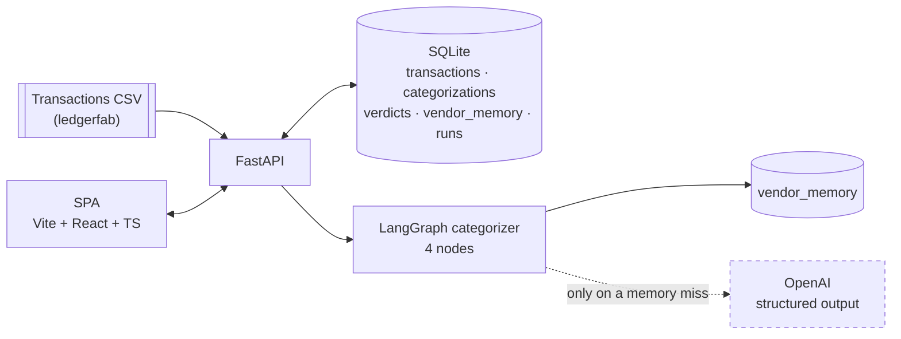
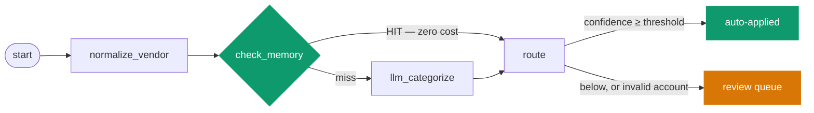
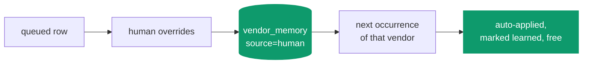

# Architecture

SpendSort is deliberately small. The interesting part is not the topology — it is the two gates
and one loop that decide what the agent is allowed to do unsupervised.

## The system



The dashed edge is the point of the whole design: the model is the *fallback*, not the default.

## The categorization graph — exactly four nodes

Per spec 11 §4 F2, and the node count is asserted by a test that fails if a fifth is ever added.



**The memory bypass is an edge, not a node.** That is what keeps the count at four while
skipping the LLM entirely. `llm_categorize` is never entered on a hit, so the call is not made,
not made-and-discarded — proven by a test that injects a categorizer which raises if invoked.

| node | what it does |
|---|---|
| `normalize_vendor` | Collapses `AMZN Mktp US*Y7D8K6` to the key memory is stored under. Descriptor cleanup only — it never decides accounts. |
| `check_memory` | Looks up the normalized vendor. A hit returns confidence 1.0 at zero cost and increments `hit_count`. |
| `llm_categorize` | Structured output `{account_code, confidence, reason}` at temperature 0.1. Checks the **cost cap before the call** and the **CoA after it**. |
| `route` | `confidence ≥ threshold` and a valid account ⇒ auto-apply. Anything else ⇒ queue. Fails closed. |

## The two gates

Both live in code, not in the prompt, because a model cannot be asked to enforce a rule about
itself.

**1. The chart-of-accounts gate** (spec 11 §8). The model's `account_code` is checked for
membership in the CoA. Out-of-CoA ⇒ confidence **forced to 0** and queued, at *any* stated
confidence — a model claiming 0.99 on an account that does not exist is not evidence, it is the
failure mode the gate exists for. The rejected code is still shown to the reviewer.

**2. The confidence gate** (spec 11 §4 F2). At or above the threshold (default 0.85) the
decision is applied with no human. Below it, the row goes to a queue sorted lowest-confidence
first.

A measured caution, from `evals/README.md`: **a higher threshold is not automatically safer.**
Raising it to 0.90 made auto-precision *worse* (96.10% → 94.23%), because the fixture's mistakes
are asserted at 0.92 and survive the cut while a third of the correct answers get queued. A
threshold only buys safety when the model's errors are less confident than its correct answers.

## The learning loop



Memory is written two ways:

- **`human`** — an override. The strongest signal available, and never overwritten by the model.
  Once a person has answered, no amount of model confidence outranks them.
- **`llm-confirmed`** — an answer the gate already trusted enough to apply unsupervised. This is
  what actually bends the cost curve; if only overrides were remembered, memory would stay nearly
  empty and "gets cheaper every month" would be theatre. A **queued** guess is never promoted —
  that would launder low confidence into permanent fact.

Only a `human` mapping is labelled **"learned"** in the UI. Calling the model's own recycled
answer "learned" would overstate what happened.

## Data model

Per spec 11 §6, plus `categorizations.run_id` — the dashboard has to chart auto-rate, memory-hit
rate and cost *across* runs, which is impossible if a decision does not know which run it
belongs to.

```
transactions      id, date, amount, currency, vendor_raw, vendor_norm, status
categorizations   id, txn_id, run_id, account_code, confidence, reason,
                  source[memory|llm], coa_valid, tokens, cost_usd, created_at
verdicts          id, txn_id, action[accept|override], final_account, at
vendor_memory     vendor_norm (PK), account_code, source[human|llm-confirmed],
                  hit_count, updated_at
runs              id, started, txn_count, auto_rate, memory_hit_rate, cost_usd,
                  auto_threshold, cost_cap_usd, model, llm_mode, cost_capped
```

`runs` records the threshold and cap each run was *judged under*, so a historical run stays
readable after someone changes the settings.

## Where the honesty lives

| Concern | Mechanism |
|---|---|
| Wrong answers must not post silently | The confidence gate + **queue-recall** as a measured eval metric |
| Hallucinated accounts | CoA membership checked in code, fail-closed |
| Runaway spend | Per-run cost cap, checked **before** each call; remainder queued, never dropped |
| A flattering eval | The mock carries deliberate defects; two tests fail if it becomes an oracle |
| Mock vs real quality | Every run records `llm_mode`; the CI number is labelled mock-mode everywhere |
| Synthetic data mistaken for real | A banner on every screen, and the disclaimer in the footer |

## Deliberately absent

- **No LedgerLab MCP client.** Spec 11 §4 F1 marks it optional and spec 00 B forbids starting on
  an unbuilt upstream (Project 02).
- **No "Uncategorized" account.** A catch-all is somewhere for the agent to hide a guess, which
  defeats the gate.
- **No rules layer, no OCR, no multi-entity, no FX conversion.** Spec 11 §2 non-goals and §4 v2.
- **No invoices, POs, GL entries or accrual schedules in ledgerfab.** Spec 00 A3 lists them;
  SpendSort reads none of them.
